<div align="center">

# 🧠 Engineer Learning OS

### *The Evidence-Grounded, Local-First Learning Operating System for Software Engineers*

[](https://github.com/eulogep/daily-english-mission)
[](https://github.com/eulogep/daily-english-mission)
[](https://nextjs.org/)
[](https://react.dev/)
[](https://www.typescriptlang.org/)
[](https://tailwindcss.com/)
[](https://localfirstweb.dev/)
[](LICENSE)

<p align="center">
  <a href="#-key-features">Features</a> •
  <a href="#-architecture">Architecture</a> •
  <a href="#-quick-start">Quick Start</a> •
  <a href="#-operational-modules">Modules</a> •
  <a href="#-interactive-roadmap">Roadmap</a> •
  <a href="#-data-privacy--safety">Privacy</a>
</p>

</div>

---

## 💡 What is Engineer Learning OS?

Traditional e-learning platforms rely on **passive video watching**, **superficial badges**, and **arbitrary completion percentages** that fail to build real engineering intuition.

**Engineer Learning OS** is an open-source, local-first platform designed to turn engineering course materials and technical challenges into **verifiable mastery**. It combines **zero-hallucination document extraction**, **grounded academic quizzes**, **spaced error retrieval**, and **integrated technical English** into a distraction-free modular monolith.

> ⚡ **Core Philosophy:** No fake progress. Every competency level (`NOT_SEEN` ➔ `PRACTICED` ➔ `VERIFIED`) is derived purely from **auditable, reproducible evidence records**.

---

## ⚡ Traditional EdTech vs. Engineer Learning OS

| Feature | ❌ Traditional EdTech / LMS | ✅ Engineer Learning OS |
|---|---|---|
| **Progress Metric** | Arbitrary percentages (e.g. *"78% completed"*) | **Evidence-derived competency states** backed by auditable attempts |
| **Quiz Grounding** | Generic LLM hallucinated questions | **Exact citation matching & deterministic page anchoring** |
| **Error Handling** | *"Wrong answer, try again"* | **Pattern detection & automated spaced retrieval scheduling** |
| **Document Processing** | Proprietary cloud lock-in | **Local PDF.js + offline Docling extraction pipeline** |
| **Privacy & Storage** | Cloud tracking, vendor data harvesting | **100% Local-first, offline-capable, zero data leaks** |
| **Language Practice** | Disconnected flashcard drills | **English-in-the-Loop with audio recordings & technical feedback** |

---

## ✨ Key Features

### 📑 1. Grounded Academic Workspace (`academic-workspace`)
- **Deterministic Grounding:** Ingests real course slides (e.g., Computer Networking INF3050) and validates quizzes strictly against exact text segments and page numbers.
- **Adaptive Remediation:** If a question is missed, learners are offered contextual remediation: targeted explanations, conceptual flashcards, or section re-ingestion.

### 🔍 2. Dual Document Extraction Engine (`document-extraction`)
- **Fast Text Ingestion:** Powered by Mozilla [PDF.js](https://github.com/mozilla/pdf.js) (6.2) for fast local parsing.
- **Deep Structural Parsing:** Powered by [Docling](https://github.com/DS4SD/docling) (2.121) for complex multi-column layouts, tables, and mathematical formulas via a sandboxed local process bridge.
- **Zero Cloud Leak:** Enforces `HF_HUB_OFFLINE=1` and `TRANSFORMERS_OFFLINE=1`.

### 🔄 3. Spaced Error Retrieval (`review-engine`)
- **Error Pattern Memory:** Tracks meaningful conceptual mistakes (e.g., *TCP vs UDP confusion*, *PDU encapsulation hierarchy*, *CSV delimiter edge cases*).
- **Spaced Review Loop:** Automatically schedules overdue items with dynamic intervals based on retrieval success.

### 🎙️ 4. Technical English in the Loop (`technical-english`)
- **Microphone & Audio Store:** In-browser audio recording with local blob persistence.
- **Concise Feedback:** Provides tightly bounded lexical and grammatical feedback (capped at 3 actionable points) without hallucinating progress.

### 🏭 5. Industrial Problem Scenarios (`professional-scenarios`)
- **Realistic Workplace Cases:** Scenario solving based on synthetic industrial telemetry data.
- **Multidimensional Rubrics:** Validates factual accuracy, hypothesis vs fact separation, and actionable next steps.
- **AI-Assistance Tagging:** Explicitly separates independent student writing from AI-assisted text.

---

## 🏛️ Architecture

The codebase follows a **Clean Modular Monolith** architecture. Domain modules are decoupled from Next.js, UI frameworks, and storage adapters.

```mermaid
flowchart TD
    subgraph UI ["🖥️ Presentation Layer (Next.js 16 / React 19)"]
        Dashboard["/ (Today Dashboard)"]
        Learn["/learn (Missions & Scenarios)"]
        Subjects["/subjects (Academic Courses)"]
        Sources["/sources (Provenance Explorer)"]
        Review["/review (Spaced Retrieval)"]
        Evidence["/evidence (Audit Trail)"]
        Progress["/progress (Competency Matrix)"]
    end

    subgraph Core ["🧠 Pure Business Modules (src/modules/)"]
        AW["academic-workspace\n(Grounded Quizzes & Remediation)"]
        SE["source-engine\n(Canonical Sources & Bundles)"]
        DE["document-extraction\n(PDF.js & Docling Bridge)"]
        RE["review-engine\n(Error Pattern Memory)"]
        LR["learning-records\n(Competency Derivation)"]
        PS["professional-scenarios\n(Industrial Cases)"]
        TE["technical-english\n(Audio Evidence)"]
        DM["deep-mastery\n(Mental Model Invariants)"]
        MR["mission-runtime\n(Active Time & Session Engine)"]
    end

    subgraph Infra ["🔌 Infrastructure & Local Storage"]
        PDF["PDF.js 6.2 (Apache-2.0)"]
        Docling["Docling CLI 2.121 (MIT)"]
        Zustand["Zustand LocalStore (Browser)"]
        SQLite["SQLite / Prisma 6"]
        WebAudio["Web Audio / MediaRecorder API"]
    end

    UI --> Core
    Core --> Infra
```



---

## 🚀 Quick Start

### Prerequisites
- [Node.js](https://nodejs.org/) `>= 20.0.0` (Tested on Node 22 & 24)
- `npm` or `bun`

### 1. Clone & Install
```bash
git clone https://github.com/eulogep/daily-english-mission.git
cd daily-english-mission
npm install
```

### 2. Run Development Server
```bash
npm run dev
```
Open **[http://localhost:3000](http://localhost:3000)** in your browser.

### 3. Run Automated Tests
```bash
node --test --experimental-strip-types tests/unit/**/*.test.ts tests/integration/**/*.test.ts
```
> **Output:** `214/214 PASS` in ~2 seconds.

### 4. Build for Production
Cross-platform zero-dependency production build (Windows, Linux, macOS):
```bash
npm run build
```

---

## 📦 Operational Modules Map

```text
src/modules/
├── academic-workspace/       # Course registry, grounded quiz validation, adaptive remediation
├── source-engine/            # Canonical vs derived source records, provenance graph, mission bundles
├── document-extraction/      # Unified extraction pipeline (PDF.js adapter + Docling local bridge)
├── learning-records/         # Immutable evidence ledger & deterministic competency derivation
├── review-engine/            # Error signal detection, error patterns, spaced retrieval engine
├── professional-scenarios/   # Synthetic industrial cases & multidimensional rubrics
├── deep-mastery/             # Deliberate practice on fundamental invariants (CSV, encodings)
├── technical-english/        # Spoken/written technical English & audio evidence persistence
└── mission-runtime/          # Multi-step interactive mission runner & active time tracking
```

---

## 🗺️ Application Routes

| Route | View | Purpose |
|---|---|---|
| `/` | **Aujourd’hui** | Daily priority overview, active missions, and due reviews |
| `/learn` | **Apprendre** | Learning path catalog (Excel Foundations, Technical English, Deep Mastery, Industrial Scenarios) |
| `/subjects` | **Matières** | Multi-subject academic portal (Computer Networking INF3050 pilot) |
| `/sources` | **Sources** | Canonical source catalog, license classifications, and provenance graph |
| `/review` | **Réviser** | Spaced retrieval session tackling recorded error patterns |
| `/evidence` | **Preuves** | Auditable chronological evidence stream of learner attempts |
| `/progress` | **Progression** | Honest competency graph derived strictly from verified evidence |
| `/daily-english` | **Daily English** | Daily interactive speaking and vocabulary practice |

---

## 🛡️ Privacy, Security & Data Safety

- 🔒 **Zero Data Leaks:** Proprietary company documents, internal spreadsheets, private audio files, and personal credentials are never tracked or committed.
- 🧪 **Synthetic Fixtures Only:** All automated tests use 100% synthetic, non-sensitive fixtures (`TRAINING_SYNTHETIC`).
- 🌐 **Offline by Default:** Document extraction, audio recording, quiz grading, and competency derivation run entirely on your local machine without mandatory network calls.

---

## 🏷️ GitHub Topics & Discovery Tags

```text
learning-os, local-first, deliberate-practice, document-extraction, docling,
pdfjs, spaced-repetition, competency-tracking, technical-english, nextjs16,
react19, typescript5, tailwindcss4, edtech-open-source, privacy-first
```

---

## 🤝 Contributing

Contributions are welcome! Whether you want to add new academic subjects, create deliberate practice scenarios, or improve local document extraction bridges:

1. Fork the project
2. Create your feature branch (`git checkout -b feat/grounded-skill-pilot`)
3. Commit your changes (`git commit -m 'feat: add grounded skill pilot'`)
4. Verify all tests pass (`node --test --experimental-strip-types tests/unit/**/*.test.ts tests/integration/**/*.test.ts`)
5. Push to the branch (`git push origin feat/grounded-skill-pilot`)
6. Open a Pull Request

---

## 📄 License

Distributed under the **MIT License**. See [`LICENSE`](LICENSE) for more information.

<div align="center">
  <sub>Built with ❤️ for rigorous engineering education and lifelong mastery.</sub>
</div>
